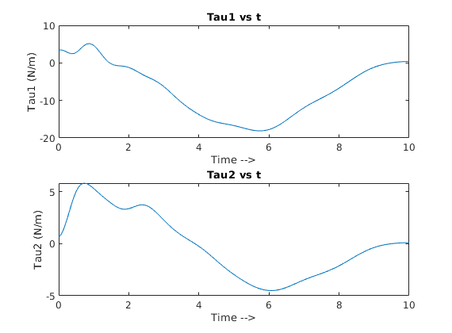

# Feedback-Linearization-Control-of-2-R-robot
2 Revolute Robotic arms are controlled using a state-feedback control and partial feedback linearization to hold it in an upright motion. 
Cubic polynomial trajectory is generated using initial and final state configurations.

## Project Description
This project implements feedback linearization control using state feedback to control a 2-revolute robotic arm. Dynamics are calculated using Manipulator equation.
Trajectories are generated for each arm using a cubic polynomial to reach desired point (upright position). Stability is also checked using eigen values. 

## Demonstration
<p align="center">
  
</p>

<p align="center">
  
</p>


## Platform
* MATLAB

## Implementation
 
Navigate to the ```Control-of-2R-arm``` folder

Open ```main.m``` file and ```RUN``` it in MATLAB workspace.
